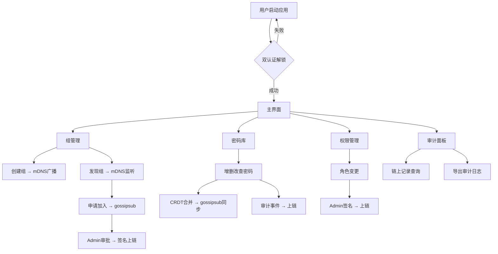

# SynapseVault 构建方案文档

> **项目名称**：SynapseVault（局域网团队密码库）
> **版本**：v0.1（初步设计）
> **日期**：2026-04-19
> **定位**：专为网络运维团队设计的纯分布式、同一网段局域网共享设备密码管理系统，完全去中心化、无任何云服务、无中心服务器。

---

## 目录

1. [项目概述与需求验证](#1-项目概述与需求验证)
2. [整体架构图](#2-整体架构图)
3. [技术栈选型与理由](#3-技术栈选型与理由)
4. [模块详细设计](#4-模块详细设计)
5. [区块链设计](#5-区块链设计)
6. [网络协议与端口选择](#6-网络协议与端口选择)
7. [安全分析与威胁模型](#7-安全分析与威胁模型)
8. [开发路线图](#8-开发路线图)
9. [潜在风险与后续优化建议](#9-潜在风险与后续优化建议)
10. [附录](#10-附录)

---

## 1. 项目概述与需求验证

### 1.1 项目背景

网络运维团队需要在局域网内共享大量设备密码（路由器、交换机、服务器等），现有方案要么依赖中心化服务器（存在单点故障和信任问题），要么使用明文表格（极度不安全）。SynapseVault 旨在提供一个**纯分布式、零信任基础设施**的密码共享方案。

### 1.2 六条核心需求逐条验证

| # | 核心需求 | 覆盖方案 | 验证方式 |
|---|---------|---------|---------|
| 1 | 同一网段局域网共享设备密码，纯分布式、自动同步、无密码（无中心认证服务器） | libp2p + mDNS 自动发现 + gossipsub 广播同步 + CRDT 无冲突合并；无任何中心节点 | 架构审查：无单点、无中心依赖 |
| 2 | 分权管理：管理权、自由使用权、审核制使用权 | RBAC 三角色体系（Admin / FreeUser / AuditUser），角色写入区块链状态 | 功能测试：三种角色行为边界 |
| 3 | 强制使用密钥文件 + 密码双认证机制，采用成熟加密算法 | 启动时独立 egui 窗口：选择 .key 文件 + 输入主密码；Argon2id 解锁密钥文件 → ed25519 私钥 | 安全审计：双因子解锁流程 |
| 4 | 图形界面，完全开源；发起者创建组，同事自动发现并加入，需 Admin 确认 | egui + eframe 原生桌面 GUI；mDNS 广播发现组；申请加入 → Admin 签名审批上链 | 用户体验测试 + 代码开源审查 |
| 5 | 密码使用和修改审计，记录含：使用时间、设备指纹码、IP 地址、链上唯一 ID | 每次操作生成 AuditEvent 结构体（含 device_fingerprint + peer_id 为主要标识，client_ip 为可选辅助字段），ed25519 签名后打包入区块链 Block | 区块链完整性验证 |
| 6 | 探索并集成区块链技术实现不可篡改审计 | 轻量 PoA 区块链，Admin 作为 validator，每条操作打包成 block，含 Merkle root | 链式哈希验证 + 签名验证 |

**全部六条核心需求已在架构层面得到覆盖。**

---

## 2. 整体架构图

### 2.1 系统分层架构（ASCII）

```
┌──────────────────────────────────────────────────────────────────┐
│                     SynapseVault Desktop App                     │
├──────────────────────────────────────────────────────────────────┤
│  egui/eframe Presentation Layer                                  │
│  ┌──────────┬──────────┬──────────┬──────────┬───────────────┐  │
│  │ 解锁窗口  │ 组管理面板│ 密码库面板│ 权限面板  │ 审计面板      │  │
│  └──────────┴──────────┴──────────┴──────────┴───────────────┘  │
├──────────────────────────────────────────────────────────────────┤
│  Application Logic Layer                                         │
│  ┌──────────┬──────────┬──────────┬──────────┬───────────────┐  │
│  │ Auth模块  │ Group模块 │ Secret模块│ RBAC模块  │ Audit模块     │  │
│  └──────────┴──────────┴──────────┴──────────┴───────────────┘  │
├──────────────────────────────────────────────────────────────────┤
│  Crypto & Storage Layer                                          │
│  ┌────────────────────┐  ┌─────────────────────────────────────┐│
│  │ CryptoCore         │  │ StorageEngine                      ││
│  │ - Argon2id KDF     │  │ - SQLCipher (加密SQLite)            ││
│  │ - XChaCha20-Poly   │  │ - CRDT Merge Engine                ││
│  │ - ed25519 签名/验签│  │ - 本地缓存管理                      ││
│  │ - 密钥派生层级     │  │                                     ││
│  └────────────────────┘  └─────────────────────────────────────┘│
├──────────────────────────────────────────────────────────────────┤
│  Blockchain Layer                                                │
│  ┌──────────────────────────────────────────────────────────────┐│
│  │ PoA Chain: Block → Block → Block → ...                      ││
│  │ Validator: Admin 节点签名                                    ││
│  │ 每个 Block: prev_hash | timestamp | signer | ops | merkle   ││
│  └──────────────────────────────────────────────────────────────┘│
├──────────────────────────────────────────────────────────────────┤
│  P2P Network Layer (libp2p)                                      │
│  ┌────────────┬───────────────┬──────────────┬────────────────┐ │
│  │ mDNS 发现   │ gossipsub 广播│ Noise 加密通道│ QUIC/TCP 传输  │ │
│  │ UDP:5353   │ Topic-based   │ X25519+      │ Port:42424     │ │
│  │            │               │ ChaCha20-Poly│ (或40000-50000)│ │
│  └────────────┴───────────────┴──────────────┴────────────────┘ │
└──────────────────────────────────────────────────────────────────┘
```

### 2.2 数据流 Mermaid 图



### 2.3 密钥派生层次结构

```
Master Password (用户输入)
    │
    ▼ Argon2id (m=65536, t=3, p=4)
Master Key (32 bytes)
    │
    ├──▶ HKDF-SHA256 → Key File Encryption Key (加密 .key 文件中的 ed25519 私钥)
    │
    ├──▶ HKDF-SHA256 → Per-Secret Key Derivation Seed (用于派生每条密码的独立加密密钥)
    │        │
    │        ▼ HKDF-SHA256(info="secret:{secret_id}")
    │    Per-Secret Key (XChaCha20-Poly1305 密钥, 32 bytes)
    │
    └──▶ ed25519 Private Key (从 .key 文件解密获得)
             │
             ▼
         ed25519 Public Key (节点身份标识)
```

---

## 3. 技术栈选型与理由

### 3.1 核心依赖列表

| 类别 | Crate | 版本要求 | 选型理由 |
|------|-------|---------|---------|
| **GUI** | `egui` + `eframe` | ≥0.34.1 | Rust 生态最成熟的 immediate mode GUI，原生桌面渲染（wgpu/glow），无 WebView 依赖，跨平台一致性好 |
| **GUI 扩展** | `egui_extras` | ≥0.26 | 提供 Table/Column 等高级组件，用于密码列表和审计表格 |
| **P2P 网络** | `libp2p` | ≥0.49.4（已修复已知 gossipsub DoS/Crash CVE），推荐使用最新 0.54.x 或更高 | Rust 生态唯一的成熟 P2P 栈，内置 mDNS 发现 + Noise 加密 + gossipsub 广播；CVE-2026-33040/34219/35405 影响早期 gossipsub，0.49.4+ 已修复；**必须显式配置 gossipsub mesh 参数 + rate limiting** |
| **密钥派生** | `argon2` | ≥0.5 | RustCrypto 官方 Argon2id 实现，纯 Rust，PHC 竞赛冠军算法 |
| **对称加密** | `chacha20poly1305` | ≥0.10 | RustCrypto 官方实现，支持 XChaCha20-Poly1305（192-bit nonce），纯 Rust + 可选 AVX2 加速 |
| **非对称签名** | `ed25519-dalek` | ≥2.2 | dalek-cryptography 系列纯 Rust 实现，高性能 ed25519 签名 |
| **HKDF** | `hkdf` | ≥0.12 | RustCrypto 官方 HKDF-SHA256，用于密钥层次派生 |
| **加密存储** | `rusqlite` (bundled-sqlcipher) | ≥0.39 + `bundled-sqlcipher` feature | SQLCipher 通过 feature flag 静态链接，AES-256 透明加密，零额外 C 依赖；0.39 包含 SQLite 3.46+ / SQLCipher 4.6+ 安全更新 |
| **CRDT** | `crdts` | ≥7.0 | 纯 Rust CRDT 库，提供 OR-Set / LWW-Register / G-Counter 等常用类型，经过测试 |
| **序列化** | `serde` + `serde_json` + `bincode` | 最新 | JSON 用于导出/调试，bincode 用于 P2P 高效传输 |
| **时间** | `chrono` | ≥0.4 | UTC 时间戳生成 |
| **设备指纹** | `machine-uid` | ≥0.5 | 跨平台获取机器唯一标识 |
| **本机 IP** | `local-ip-address` | ≥0.6 | 获取本机局域网 IP |
| **随机数** | `rand` + `rand_core` | ≥0.8 | 密码学安全随机数生成 |
| **日志** | `tracing` + `tracing-subscriber` | 最新 | 结构化日志，异步友好 |
| **错误处理** | `anyhow` + `thiserror` | 最新 | anyhow 用于应用层，thiserror 用于库层 |

### 3.2 关键选型说明

#### 为什么选 egui 而不是 Tauri/WebView？
- 安全性：WebView 引入巨大攻击面（Chromium 内核），密码管理器不能接受
- 原生性：egui 直接通过 wgpu/glow 渲染，无 HTML/CSS/JS 依赖
- 轻量性：单一二进制，无运行时依赖，适合运维工具
- 注意：egui 是 immediate mode，每帧重绘，对于密码列表等需要手动管理状态

#### 为什么选 libp2p 而不是手写网络？
- mDNS 内置，无需自行实现多播发现
- Noise 协议内置（X25519 + ChaCha20-Poly1305），提供完美前向保密
- gossipsub 是成熟的 pub/sub 协议，适合 CRDT 广播
- **重要**：libp2p 的 gossipsub 在 2026 年初发现了多个 DoS CVE（CVE-2026-33040, CVE-2026-34219, CVE-2026-35405），影响早期版本（≤0.49.3），0.49.4 已修复；推荐使用最新 0.54.x 或更高版本；必须显式配置 `mesh_n_high`/`mesh_n_low`/`mesh_outbound_min` 参数 + rate limiting 防止泛洪攻击；定期运行 `cargo audit` 并关注 rust-libp2p 安全公告

#### 为什么选 rusqlite(bundled-sqlcipher) 而不是独立 SQLCipher？
- `bundled-sqlcipher` feature 会自动编译 SQLCipher 源码，无需系统安装 libsqlcipher
- 交叉编译友好，直接 `cargo build --release` 即可
- API 与普通 rusqlite 完全一致，只需在打开数据库时传入密钥
- **注意**：交叉编译时 `bundled-sqlcipher` 需要系统的 C 编译器和 OpenSSL/crypto 后端，部分平台可能需要额外配置

#### 为什么选 `crdts` 而不是 Automerge？
- `crdts` 是纯算法库，不含网络层，更轻量
- 我们只需要 OR-Set（成员管理）和 LWW-Register（密码条目），不需要文本 CRDT
- Automerge 偏向文档协作，对于密码条目的 KV 结构过重

---

## 4. 模块详细设计

### 4.1 项目目录结构

```
synapse-vault/
├── Cargo.toml
├── Cargo.lock
├── .cargo/
│   └── config.toml              # 交叉编译配置
├── src/
│   ├── main.rs                  # 入口：eframe 启动
│   ├── app.rs                   # SynapseVaultApp 主状态机
│   │
│   ├── auth/                    # 启动与双认证模块
│   │   ├── mod.rs
│   │   ├── keyfile.rs           # .key 文件读写与加密
│   │   ├── unlock.rs            # Argon2id 解锁逻辑
│   │   └── device_fingerprint.rs # 设备指纹生成
│   │
│   ├── crypto/                  # 加密核心模块
│   │   ├── mod.rs
│   │   ├── kdf.rs               # Argon2id + HKDF 密钥派生
│   │   ├── symmetric.rs         # XChaCha20-Poly1305 加解密
│   │   ├── signing.rs           # ed25519 签名与验签
│   │   └── key_derivation.rs    # Per-secret 密钥派生
│   │
│   ├── group/                   # 组管理模块
│   │   ├── mod.rs
│   │   ├── manager.rs           # 创建组/发现组/加入组
│   │   ├── member.rs            # 成员管理
│   │   └── group_key.rs         # 群组主密钥管理
│   │
│   ├── rbac/                    # 权限管理模块
│   │   ├── mod.rs
│   │   ├── role.rs              # 角色定义与权限校验
│   │   └── policy.rs            # 策略引擎
│   │
│   ├── secret/                  # 密码管理模块
│   │   ├── mod.rs
│   │   ├── entry.rs             # 密码条目数据结构
│   │   ├── store.rs             # 密码 CRUD 操作
│   │   ├── import_export.rs     # 批量导入/导出
│   │   └── clipboard.rs         # 安全剪贴板操作
│   │
│   ├── p2p/                     # P2P 网络模块
│   │   ├── mod.rs
│   │   ├── discovery.rs         # mDNS 发现封装
│   │   ├── transport.rs         # Noise + QUIC/TCP 传输
│   │   ├── gossip.rs            # gossipsub 消息处理
│   │   ├── protocol.rs          # 自定义协议消息类型
│   │   └── event_loop.rs        # Swarm 事件循环
│   │
│   ├── sync/                    # 数据同步模块
│   │   ├── mod.rs
│   │   ├── crdt_engine.rs       # CRDT 合并引擎
│   │   ├── merge.rs             # 冲突解决策略
│   │   └── snapshot.rs          # 状态快照
│   │
│   ├── blockchain/              # 区块链模块
│   │   ├── mod.rs
│   │   ├── block.rs             # Block 结构与哈希
│   │   ├── chain.rs             # 链管理与验证
│   │   ├── consensus.rs         # PoA 共识逻辑
│   │   ├── merkle.rs            # Merkle 树计算
│   │   └── validator.rs         # 验证者（Admin）逻辑
│   │
│   ├── audit/                   # 审计模块
│   │   ├── mod.rs
│   │   ├── event.rs             # 审计事件结构体
│   │   ├── logger.rs            # 审计日志写入
│   │   └── export.rs            # 审计日志导出
│   │
│   ├── storage/                 # 存储模块
│   │   ├── mod.rs
│   │   ├── database.rs          # SQLCipher 连接管理
│   │   ├── schema.rs            # 数据库 Schema 定义
│   │   └── cache.rs             # 本地缓存层
│   │
│   └── ui/                      # egui 界面模块
│       ├── mod.rs
│       ├── unlock_window.rs     # 解锁窗口
│       ├── main_layout.rs       # 主布局框架
│       ├── top_bar.rs           # 顶部状态栏
│       ├── side_panel.rs        # 侧边导航
│       ├── group_panel.rs       # 组管理面板
│       ├── secret_panel.rs      # 密码库面板
│       ├── rbac_panel.rs        # 权限面板
│       ├── audit_panel.rs       # 审计面板
│       ├── dialogs/             # 弹窗集合
│       │   ├── mod.rs
│       │   ├── create_group.rs
│       │   ├── join_group.rs
│       │   ├── approve_member.rs
│       │   ├── view_secret.rs
│       │   └── audit_detail.rs
│       └── theme.rs             # Dark/Light 主题切换
│
├── tests/                       # 单元集成测试
│   ├── crypto_tests.rs
│   ├── crdt_tests.rs
│   ├── blockchain_tests.rs
│   └── p2p_tests.rs
│
├── integration_tests/           # 多节点 P2P 端到端测试
│   ├── multi_node_sync.rs
│   ├── join_approval_flow.rs
│   └── chain_consistency.rs
│
├── benches/                     # 性能基准
│   └── crypto_bench.rs
│
└── docs/                        # 文档
    └── protocol.md              # 网络协议文档
```

---

### 4.2 模块一：启动与双认证模块（auth）

#### 职责
- 应用启动时弹出独立解锁窗口，强制用户完成双认证
- 管理 .key 密钥文件的生成、加密存储和读取
- 设备指纹生成与绑定
- "忘记密码"本地重置

#### 关键结构体

```rust
/// 密钥文件格式（.key 文件内容，加密后存储）
#[derive(Serialize, Deserialize)]
pub struct KeyFile {
    pub version: u8,                           // 格式版本号，当前为 1
    pub salt: [u8; 32],                        // Argon2id 盐值
    pub encrypted_private_key: Vec<u8>,        // XChaCha20-Poly1305 加密的 ed25519 私钥
    pub nonce: [u8; 24],                       // XChaCha20-Poly1305 nonce
    pub public_key: ed25519_dalek::VerifyingKey,// 明文公钥（用于身份标识）
    pub device_fingerprint: String,            // 设备指纹（硬件ID + 公钥哈希）
    pub argon2_params: Argon2Params,           // Argon2id 参数记录
}

#[derive(Serialize, Deserialize)]
pub struct Argon2Params {
    pub memory_cost: u32,   // 默认 65536 (64 MiB)
    pub time_cost: u32,     // 默认 3
    pub parallelism: u32,   // 默认 4
}

/// 解锁状态
pub enum UnlockState {
    Locked,
    Unlocking,                  // 正在 Argon2id 计算（耗时操作）
    Unlocked(UnlockedSession),  // 已解锁
}

/// 解锁后会话
pub struct UnlockedSession {
    pub private_key: ed25519_dalek::SigningKey,  // 临时加载，退出即丢弃
    pub public_key: ed25519_dalek::VerifyingKey,
    pub master_key: [u8; 32],                    // 由 Argon2id 派生的主密钥
    pub device_fingerprint: String,
    pub unlocked_at: DateTime<Utc>,
}

/// 设备指纹
pub struct DeviceFingerprint {
    pub machine_uid: String,          // 来自 machine-uid crate
    pub pubkey_hash: [u8; 32],        // 公钥的 SHA-256 哈希
    pub combined: String,             // 格式: "{machine_uid}:{hex(pubkey_hash)}"
}
```

#### 主要函数签名

```rust
/// 生成新的密钥文件（首次使用）
pub fn generate_key_file(
    master_password: &str,
    device_fingerprint: &DeviceFingerprint,
) -> Result<KeyFile, AuthError>;

/// 从密钥文件解锁（双认证）
pub fn unlock_key_file(
    key_file_path: &Path,
    master_password: &str,
) -> Result<UnlockedSession, AuthError>;

/// 验证设备指纹是否匹配
pub fn verify_device_fingerprint(
    key_file: &KeyFile,
    current_fingerprint: &DeviceFingerprint,
) -> Result<(), AuthError>;

/// 本地重置密码（仅影响本机，重新加密私钥）
pub fn reset_password(
    key_file_path: &Path,
    old_password: &str,
    new_password: &str,
) -> Result<(), AuthError>;

/// 安全擦除敏感内存
pub fn secure_zero(data: &mut [u8]);
```

#### egui 交互流程

1. 应用启动 → 检测是否存在 .key 文件
2. **不存在** → 显示"首次设置"窗口：输入主密码 → 确认主密码 → 生成 .key 文件 → 自动保存到用户选择路径 → 进入主界面
3. **存在** → 显示"解锁"窗口：选择 .key 文件 → 输入主密码 → Argon2id 解锁（显示进度条）→ 进入主界面
4. 解锁失败 → 显示错误信息，可重试或选择"忘记密码"

**"忘记密码"处理流程**：
- 本地重置会重新生成 .key 文件（新的 ed25519 密钥对 + 新 Argon2id 盐值）
- 重置后本机身份变更，与组内其他节点的旧身份断开
- 需要重新申请加入组，或由 Admin 通过安全通道（如当面）重新下发群组主密钥
- 本地数据库中的密码条目**无法恢复**（密钥已丢失），但组内其他节点仍有完整数据
- UI 必须在重置前弹出醒目警告，说明数据丢失和重加入的后果

**重要安全约束**：
- `UnlockedSession` 中的 `private_key` 和 `master_key` 必须使用 `zeroize` crate 在 Drop 时安全擦除
- Argon2id 计算是耗时操作（约 1-3 秒），必须在独立线程执行，egui 主线程使用 `Arc<Mutex<UnlockState>>` 轮询状态
- .key 文件中的私钥明文**永远不写入磁盘**，仅在内存中临时存在

---

### 4.3 模块二：组管理模块（group）

#### 职责
- 创建新组：生成组 ID + 群组主密钥对 → 开始 mDNS 广播
- 发现组：监听 mDNS 广播，列出可加入组
- 申请加入：发送公钥 + 签名请求
- Admin 审批：一键同意/拒绝，签名上链

#### 关键结构体

```rust
/// 组信息
#[derive(Clone, Serialize, Deserialize)]
pub struct Group {
    pub group_id: GroupId,                    // 组唯一标识（ed25519 公钥哈希前 16 字节的 hex）
    pub name: String,                         // 组名
    pub group_public_key: VerifyingKey,       // 群组主密钥公钥
    pub created_at: DateTime<Utc>,
    pub admin_public_key: VerifyingKey,       // 创建者（初始 Admin）公钥
    pub members: Orswot<MemberId, Actor>,     // CRDT OR-Set 管理成员
    pub config: GroupConfig,
}

#[derive(Clone, Serialize, Deserialize)]
pub struct GroupConfig {
    pub gossip_port: u16,             // 默认 42424
    pub max_members: u32,             // 默认 50
    pub require_approval: bool,       // 加入是否需要审批（默认 true）
}

/// 组成员
#[derive(Clone, Serialize, Deserialize, PartialEq, Eq, Hash)]
pub struct Member {
    pub member_id: MemberId,          // 公钥的 hex
    pub public_key: VerifyingKey,
    pub role: Role,                   // Admin / FreeUser / AuditUser
    pub device_fingerprint: String,
    pub joined_at: DateTime<Utc>,
    pub status: MemberStatus,         // Active / Pending / Revoked
}

pub type MemberId = String;  // ed25519 公钥 hex 编码
pub type GroupId = String;   // 组 ID

#[derive(Clone, Serialize, Deserialize, PartialEq, Eq)]
pub enum MemberStatus {
    Active,
    PendingApproval,  // 等待 Admin 审批
    Revoked,          // 已被吊销
}

/// 加入请求
#[derive(Clone, Serialize, Deserialize)]
pub struct JoinRequest {
    pub group_id: GroupId,
    pub requester_public_key: VerifyingKey,
    pub device_fingerprint: String,
    pub timestamp: DateTime<Utc>,
    pub signature: Signature,           // 请求者用自己私钥签名
}
```

#### 主要函数签名

```rust
/// 创建新组（成为 Admin）
pub fn create_group(
    name: &str,
    admin_signing_key: &SigningKey,
    config: GroupConfig,
) -> Result<(Group, GroupSigningKey), GroupError>;

/// 开始 mDNS 广播本组
pub fn start_broadcast(group: &Group, port: u16) -> Result<(), GroupError>;

/// 停止广播
pub fn stop_broadcast(group_id: &GroupId) -> Result<(), GroupError>;

/// 发现附近组（mDNS 监听）
pub fn discover_groups() -> impl Stream<Item = DiscoveredGroup>;

/// 申请加入组
pub fn request_join(
    group: &DiscoveredGroup,
    my_signing_key: &SigningKey,
    device_fingerprint: &DeviceFingerprint,
) -> Result<JoinRequest, GroupError>;

/// Admin 审批加入请求
pub fn approve_join(
    group: &mut Group,
    request: &JoinRequest,
    admin_signing_key: &SigningKey,
) -> Result<BlockchainOp, GroupError>;

/// Admin 拒绝加入请求
pub fn reject_join(
    group: &mut Group,
    request: &JoinRequest,
    admin_signing_key: &SigningKey,
) -> Result<(), GroupError>;

/// Admin 移除成员
pub fn remove_member(
    group: &mut Group,
    member_id: &MemberId,
    admin_signing_key: &SigningKey,
) -> Result<BlockchainOp, GroupError>;
```

#### egui 交互流程

1. **"组管理"面板**显示：当前已加入的组列表 + "创建新组"按钮 + "发现组"按钮
2. 点击"创建新组" → 弹出 `egui::Window`：输入组名 → 确认 → 自动创建并开始广播
3. 点击"发现组" → 自动扫描 mDNS，显示列表（组名、Admin 公钥缩略、在线人数）→ 点击"申请加入"
4. Admin 收到加入请求 → 通知弹窗 → "同意"/"拒绝"按钮 → 签名上链

**关键注意事项**：
- 群组主密钥对（`GroupSigningKey`）是组的最高权限凭证，只有 Admin 持有私钥
- 成员变更必须通过区块链记录，保证最终一致性
- mDNS 广播信息**不含任何密码数据**，仅包含组 ID、组名、Admin 公钥哈希、端口号

---

### 4.4 模块三：权限管理系统（rbac）

#### 职责
- 定义和校验三种角色权限：Admin、FreeUser、AuditUser
- 角色信息存储在区块链状态中
- 本地缓存 + 区块链最终一致性

#### 关键结构体

```rust
/// 角色定义
#[derive(Clone, Serialize, Deserialize, PartialEq, Eq, Debug)]
pub enum Role {
    Admin,      // 修改密码 + 审核审批 + 管理成员 + 查看审计
    FreeUser,   // 直接使用密码（无需申请）
    AuditUser,  // 使用密码前必须经 Admin 授权
}

/// 权限检查结果
pub enum PermissionCheck {
    Allowed,
    Denied(String),          // 拒绝原因
    RequiresApproval {       // AuditUser 需要审批
        approval_id: String,
        requested_at: DateTime<Utc>,
    },
}

/// 角色变更操作（上链）
#[derive(Clone, Serialize, Deserialize)]
pub struct RoleChangeOp {
    pub target_member: MemberId,
    pub old_role: Role,
    pub new_role: Role,
    pub changed_by: MemberId,     // 必须是 Admin
    pub timestamp: DateTime<Utc>,
}

/// 使用申请（AuditUser → Admin）
#[derive(Clone, Serialize, Deserialize)]
pub struct UsageRequest {
    pub request_id: String,
    pub requester: MemberId,
    pub target_secret_id: SecretId,
    pub reason: String,
    pub timestamp: DateTime<Utc>,
    pub signature: Signature,
}
```

#### 主要函数签名

```rust
/// 检查权限
pub fn check_permission(
    role: &Role,
    action: &Action,
) -> PermissionCheck;

/// Admin 变更角色
pub fn change_role(
    group: &mut Group,
    target_member: &MemberId,
    new_role: Role,
    admin_signing_key: &SigningKey,
) -> Result<RoleChangeOp, RbacError>;

/// AuditUser 请求使用密码
pub fn request_usage(
    secret_id: &SecretId,
    reason: &str,
    requester_signing_key: &SigningKey,
) -> Result<UsageRequest, RbacError>;

/// Admin 审批使用请求
pub fn approve_usage(
    request: &UsageRequest,
    admin_signing_key: &SigningKey,
) -> Result<BlockchainOp, RbacError>;
```

#### 权限矩阵

| 操作 | Admin | FreeUser | AuditUser |
|------|-------|----------|-----------|
| 查看密码列表（加密条目） | ✅ | ✅ | ✅ |
| 查看/复制密码明文 | ✅ | ✅ | ❌（需审批） |
| 新增密码 | ✅ | ❌ | ❌ |
| 修改密码 | ✅ | ❌ | ❌ |
| 删除密码 | ✅ | ❌ | ❌ |
| 审批使用请求 | ✅ | ❌ | ❌ |
| 管理成员 | ✅ | ❌ | ❌ |
| 变更角色 | ✅ | ❌ | ❌ |
| 查看审计日志 | ✅ | ❌ | ✅（仅自身） |
| 导入/导出密码 | ✅ | ❌ | ❌ |

**关键注意事项**：
- AuditUser 查看密码列表时只能看到条目名称和元信息，不能看到密码值
- 审批流程：AuditUser 发出请求 → gossipsub 广播给 Admin → Admin 同意后签名授权 → 授权信息广播回来 → AuditUser 获得临时解密令牌（有效期可配，默认 5 分钟）
- 角色变更必须由 Admin 签名并写入区块链，其他节点从链上同步角色状态

---

### 4.5 模块四：密码管理模块（secret）

#### 职责
- 密码条目的增删改查
- 批量导入/导出（加密 JSON）
- 安全剪贴板操作
- 搜索、过滤、按环境分组
- 查看/复制密码时触发审计事件

#### 关键结构体

```rust
/// 密码条目
#[derive(Clone, Serialize, Deserialize)]
pub struct SecretEntry {
    pub secret_id: SecretId,           // UUID v4
    pub title: String,                 // 条目标题（如 "核心交换机-SSH"）
    pub username: String,              // 用户名
    pub encrypted_password: Vec<u8>,   // XChaCha20-Poly1305 加密的密码
    pub nonce: [u8; 24],               // 加密 nonce
    pub environment: String,           // 环境分组（生产/测试/开发）
    pub tags: Vec<String>,             // 标签
    pub description: String,           // 描述
    pub created_at: DateTime<Utc>,
    pub updated_at: DateTime<Utc>,
    pub created_by: MemberId,
    pub version: u64,                  // CRDT 版本号
    pub expires_at: Option<DateTime<Utc>>,  // 密码过期时间（运维密码定期轮换）
}

/// 密码条目元信息（不含密码值，用于列表显示）
#[derive(Clone, Serialize, Deserialize)]
pub struct SecretMeta {
    pub secret_id: SecretId,
    pub title: String,
    pub username: String,
    pub environment: String,
    pub tags: Vec<String>,
    pub updated_at: DateTime<Utc>,
    pub expires_at: Option<DateTime<Utc>>,  // 过期时间（用于列表高亮提醒）
}

/// 密码操作（CRDT 意图）
#[derive(Clone, Serialize, Deserialize)]
pub enum SecretOp {
    Create(SecretEntry),
    Update {
        secret_id: SecretId,
        encrypted_password: Vec<u8>,
        nonce: [u8; 24],
        updated_at: DateTime<Utc>,
        updated_by: MemberId,
    },
    Delete {
        secret_id: SecretId,
        deleted_by: MemberId,
        deleted_at: DateTime<Utc>,
    },
}

/// 批量导入/导出格式
#[derive(Serialize, Deserialize)]
pub struct SecretExport {
    pub version: u8,
    pub exported_at: DateTime<Utc>,
    pub group_id: GroupId,
    pub entries: Vec<SecretExportEntry>,
}

#[derive(Serialize, Deserialize)]
pub struct SecretExportEntry {
    pub title: String,
    pub username: String,
    pub password: String,              // 明文（整体文件加密）
    pub environment: String,
    pub tags: Vec<String>,
    pub description: String,
    pub expires_at: Option<DateTime<Utc>>,
}

pub type SecretId = String;  // UUID v4
```

#### 主要函数签名

```rust
/// 创建密码条目（仅 Admin）
pub fn create_secret(
    title: &str,
    username: &str,
    password: &str,
    environment: &str,
    tags: Vec<String>,
    description: &str,
    expires_at: Option<DateTime<Utc>>,   // 密码过期时间
    creator: &MemberId,
    master_key: &[u8; 32],
) -> Result<(SecretEntry, SecretOp, AuditEvent), SecretError>;

/// 解密密码（触发审计）
pub fn decrypt_secret(
    entry: &SecretEntry,
    master_key: &[u8; 32],
    requester: &MemberId,
    role: &Role,
) -> Result<(String, AuditEvent), SecretError>;

/// 更新密码（仅 Admin）
pub fn update_secret(
    entry: &mut SecretEntry,
    new_password: &str,
    updater: &MemberId,
    master_key: &[u8; 32],
) -> Result<(SecretOp, AuditEvent), SecretError>;

/// 删除密码（仅 Admin）
pub fn delete_secret(
    secret_id: &SecretId,
    deleter: &MemberId,
) -> Result<(SecretOp, AuditEvent), SecretError>;

/// 搜索密码
pub fn search_secrets(
    entries: &[SecretMeta],
    query: &str,
    environment: Option<&str>,
    tags: Option<&[String]>,
) -> Vec<&SecretMeta>;

/// 安全复制到剪贴板（限定时间后自动清除）
pub fn copy_to_clipboard_secure(
    password: &str,
    clear_after_secs: u64,  // 默认 30 秒
) -> Result<(), SecretError>;

/// 批量导入
pub fn import_secrets(
    encrypted_json: &[u8],
    decryption_key: &[u8; 32],
    importer: &MemberId,
) -> Result<Vec<(SecretEntry, SecretOp, AuditEvent)>, SecretError>;

/// 批量导出
pub fn export_secrets(
    entries: &[SecretEntry],
    master_key: &[u8; 32],
) -> Result<Vec<u8>, SecretError>;
```

#### egui 交互流程

1. **密码库面板**：左侧为过滤面板（环境下拉、标签多选、搜索框），右侧为 `egui_extras::Table` 密码列表
2. 列表列：标题 | 用户名 | 环境 | 标签 | 更新时间 | 过期状态 | 操作按钮
3. 过期密码条目在列表中**红色高亮**显示，即将过期（7 天内）**黄色高亮**，已过期条目在标题前显示警告图标
3. **Admin** 操作按钮：查看、编辑、删除
4. **FreeUser** 操作按钮：查看（复制）
5. **AuditUser** 操作按钮：申请使用
6. 点击"查看" → 弹出 `egui::Window` 显示密码详情 → 复制按钮 → 触发审计
7. 点击"复制" → 密码复制到剪贴板 → 30 秒倒计时自动清除 → 显示倒计时提示

**关键注意事项**：
- 密码值使用 per-secret 密钥加密：`HKDF-SHA256(master_key, info="secret:{secret_id}")` 派生独立密钥
- 这样即使某个密码的加密被破解，不会影响其他密码
- 明文密码**绝不在内存中长期保留**，解密后使用 `zeroize` 立即标记
- 剪贴板清除使用后台线程计时，不依赖 egui 帧循环
- 密码列表显示的是 `SecretMeta`（不含密码值），只有点击查看时才解密

---

### 4.6 模块五：P2P 同步模块（p2p + sync）

#### 职责
- mDNS 自动发现同网段节点
- Noise 加密通道建立
- gossipsub 消息广播与接收
- CRDT 状态合并与冲突解决
- 网络抖动恢复与重连

#### 关键结构体

```rust
/// P2P 网络消息类型
#[derive(Clone, Serialize, Deserialize)]
pub enum P2pMessage {
    // 组管理
    GroupAnnounce(DiscoveredGroup),         // mDNS 发现的组信息
    JoinRequest(JoinRequest),               // 加入请求
    JoinApproved {                          // 加入审批通过
        group_id: GroupId,
        member: Member,
        approval_signature: Signature,
    },
    JoinRejected {                          // 加入被拒绝
        group_id: GroupId,
        requester: MemberId,
    },

    // 密码同步
    SecretOp(SecretOp),                     // 密码操作
    SecretSyncRequest {                     // 请求全量同步
        group_id: GroupId,
        from_version: u64,
    },
    SecretSyncResponse {                    // 全量同步响应
        group_id: GroupId,
        entries: Vec<SecretEntry>,
        crdt_state: Vec<u8>,               // CRDT 状态向量
    },

    // 权限同步
    RoleChange(RoleChangeOp),               // 角色变更
    UsageRequest(UsageRequest),             // 使用请求
    UsageApproval {                         // 使用审批
        request_id: String,
        approval: Signature,
        expires_at: DateTime<Utc>,
    },

    // 区块链同步
    NewBlock(Block),                        // 新区块广播
    ChainSyncRequest {                      // 链同步请求
        group_id: GroupId,
        from_height: u64,
    },
    ChainSyncResponse {                     // 链同步响应
        blocks: Vec<Block>,
    },
}

/// CRDT 同步状态
pub struct SyncState {
    pub vector_clock: BTreeMap<Actor, u64>,  // 向量时钟
    pub last_sync_at: DateTime<Utc>,
    pub pending_ops: Vec<PendingOp>,         // 离线期间的待同步操作
}

/// 发现的组（mDNS 广播内容）
#[derive(Clone, Serialize, Deserialize)]
pub struct DiscoveredGroup {
    pub group_id: GroupId,
    pub name: String,
    pub admin_pubkey_hash: String,           // Admin 公钥 SHA-256 前 8 字节 hex
    pub port: u16,
    pub peer_id: PeerId,                     // libp2p PeerId
    pub discovered_at: DateTime<Utc>,
}
```

#### 主要函数签名

```rust
/// 初始化 libp2p Swarm
pub fn create_swarm(
    local_keypair: Keypair,
    listen_port: u16,
) -> Result<Swarm<Behaviour>, P2pError>;

/// 构建 Swarm Behaviour（组合 mDNS + gossipsub + Noise + QUIC）
pub fn build_behaviour(
    local_keypair: Keypair,
) -> Behaviour;

/// 发送 gossipsub 消息
pub fn broadcast_message(
    swarm: &mut Swarm<Behaviour>,
    topic: &str,
    message: &P2pMessage,
) -> Result<(), P2pError>;

/// CRDT 合并接收到的操作
pub fn merge_crdt_op(
    local_state: &mut CrdtState,
    remote_op: &P2pMessage,
) -> Result<MergeResult, SyncError>;

/// 处理 Swarm 事件（在 eframe::update 中轮询）
pub fn poll_swarm_events(
    swarm: &mut Swarm<Behaviour>,
    app_state: &mut AppState,
) -> Vec<P2pEvent>;
```

#### 网络行为组合（libp2p NetworkBehaviour）

```rust
#[derive(NetworkBehaviour)]
pub struct Behaviour {
    pub mdns: mdns::tokio::Behaviour,            // mDNS 发现
    pub gossipsub: gossipsub::Behaviour,          // 消息广播
    pub kademlia: kad::Behaviour<Sha256>,         // DHT（可选，用于跨网段发现）
    pub identify: identify::Behaviour,            // 节点身份识别
    pub relay: relay::client::Behaviour,          // 中继（可选，用于 NAT 穿透）
}
```

#### 冲突解决策略

```
冲突场景                          解决策略
────────────────────────────────────────────────────────────
两个 Admin 同时修改同一密码     LWW (Last Writer Wins)：比较 timestamp + MemberId 排序
两个节点同时加入不同成员         OR-Set：两个加入操作都是 add，合并不冲突
一个节点修改密码，另一个删除     优先级：删除 > 修改（需要 Admin 二次确认）
网络分区后合并                  CRDT 自动合并 + 区块链最终一致性验证
区块链分叉                      PoA：以最长链为准，Admin 签名的链为权威链
```

**关键注意事项**：
- gossipsub topic 命名格式：`synapsevault/{group_id}/secrets`、`synapsevault/{group_id}/blocks`、`synapsevault/{group_id}/control`
- 所有消息先序列化为 bincode 再发送，减少带宽
- 新节点加入组后先请求全量同步（SecretSyncRequest），再进入增量模式
- 网络断开重连后自动重新同步，比对 vector_clock 确定差量
- **gossipsub 参数必须配置**：`mesh_n_high=6`, `mesh_n_low=4`, `mesh_outbound_min=2`，防止恶意节点泛洪

---

### 4.7 模块六：审计与区块链模块（audit + blockchain）

#### 职责
- 每次操作生成审计事件并签名
- 审计事件打包成区块链 Block
- PoA 共识（Admin 签名验证）
- 链完整性校验
- 审计面板展示与导出

#### 关键结构体

```rust
/// 审计事件
#[derive(Clone, Serialize, Deserialize)]
pub struct AuditEvent {
    pub event_id: String,                        // UUID v4
    pub timestamp: DateTime<Utc>,                // UTC 时间
    pub device_fingerprint: String,              // 硬件ID + 公钥哈希（主要身份标识）
    pub peer_id: String,                         // libp2p PeerId（辅助标识）
    pub client_ip: Option<String>,               // 当前 IP（可选，局域网 IP 可能不准确或被 NAT 修改）
    pub operation_type: OperationType,            // 操作类型
    pub target_secret_id: Option<SecretId>,       // 目标密码 ID
    pub actor_member_id: MemberId,                // 操作者
    pub block_hash: Option<String>,               // 链上唯一 ID（打包后回填）
    pub signature: Signature,                     // 操作者签名
}

#[derive(Clone, Serialize, Deserialize, PartialEq, Eq, Debug)]
pub enum OperationType {
    ViewSecret,           // 查看密码
    CopySecret,           // 复制密码
    CreateSecret,         // 创建密码
    UpdateSecret,         // 修改密码
    DeleteSecret,         // 删除密码
    ApproveJoin,          // 审批加入
    RejectJoin,           // 拒绝加入
    RemoveMember,         // 移除成员
    ChangeRole,           // 变更角色
    ApproveUsage,         // 审批使用
    ExportSecrets,        // 导出密码
    ImportSecrets,        // 导入密码
    ResetPassword,        // 重置密码
}

/// 区块链 Block
#[derive(Clone, Serialize, Deserialize)]
pub struct Block {
    pub height: u64,                             // 区块高度
    pub prev_hash: [u8; 32],                     // 前一区块哈希（SHA-256）
    pub timestamp: DateTime<Utc>,                // 出块时间
    pub signer_pubkey: VerifyingKey,             // 签名者公钥（Admin）
    pub signature: Signature,                    // Admin 签名
    pub ops: Vec<AuditEvent>,                    // 本块包含的操作
    pub merkle_root: [u8; 32],                   // ops 的 Merkle 根
    pub nonce: u64,                              // 防重放
}

/// 区块链
#[derive(Clone, Serialize, Deserialize)]
pub struct Chain {
    pub group_id: GroupId,
    pub blocks: Vec<Block>,
    pub pending_ops: Vec<AuditEvent>,            // 待打包的操作
    pub validators: Vec<VerifyingKey>,            // 验证者列表（Admin 公钥）
    pub last_block_hash: [u8; 32],
    pub height: u64,
}

/// Merkle 树节点
pub struct MerkleTree {
    pub root: [u8; 32],
    pub leaves: Vec<[u8; 32]>,
}
```

#### 主要函数签名

```rust
/// 创建创世块
pub fn create_genesis_block(
    group_id: &GroupId,
    admin_signing_key: &SigningKey,
) -> Block;

/// 添加审计事件到待打包队列
pub fn queue_audit_event(event: AuditEvent) -> Result<(), ChainError>;

/// 打包新区块（Admin 节点执行）
pub fn forge_block(
    chain: &mut Chain,
    admin_signing_key: &SigningKey,
    max_ops_per_block: usize,   // 默认 50
) -> Result<Block, ChainError>;

/// 验证区块签名和哈希
pub fn verify_block(block: &Block, validators: &[VerifyingKey]) -> Result<(), ChainError>;

/// 验证整条链
pub fn verify_chain(chain: &Chain) -> Result<(), ChainError>;

/// 计算 Merkle 根
pub fn compute_merkle_root(events: &[AuditEvent]) -> [u8; 32];

/// 计算 Block 哈希
pub fn compute_block_hash(block: &Block) -> [u8; 32];

/// 查询审计日志
pub fn query_audit_log(
    chain: &Chain,
    filter: AuditFilter,
) -> Vec<&AuditEvent>;

/// 导出审计日志
pub fn export_audit_log(
    chain: &Chain,
    encryption_key: &[u8; 32],
) -> Result<Vec<u8>, ChainError>;

/// 生成审计事件并签名
pub fn create_audit_event(
    operation_type: OperationType,
    target_secret_id: Option<&SecretId>,
    actor_signing_key: &SigningKey,
    device_fingerprint: &DeviceFingerprint,
    peer_id: &str,
    client_ip: Option<&str>,             // 可选，优先使用 device_fingerprint + peer_id
) -> AuditEvent;
```

#### 区块链工作流程

```
1. 任何节点执行操作（查看/修改密码等）
      │
      ▼
2. 生成 AuditEvent + ed25519 签名
      │
      ▼
3. gossipsub 广播 AuditEvent 到组内所有节点
      │
      ▼
4. Admin 节点收集 pending_ops
      │
      ▼ （满足任一条件即出块）
   ├── pending_ops 达到 max_ops_per_block（默认 50）
   ├── 距上一个块超过 max_block_interval（默认 60 秒）
   └── 手动触发出块
      │
      ▼
5. Admin 计算 Merkle root + 签名 → 生成 Block
      │
      ▼
6. gossipsub 广播新区块
      │
      ▼
7. 非 Admin 节点验证区块：
   ├── 签名者是否在 validators 列表中
   ├── prev_hash 是否匹配
   ├── merkle_root 是否正确
   ├── 每个 AuditEvent 签名是否有效
   └── nonce 是否递增
      │
      ▼
8. 验证通过 → 追加到本地链
   验证失败 → 拒绝并告警
```

#### 出块参数（可配置）

| 参数 | 默认值 | 说明 |
|------|-------|------|
| `max_ops_per_block` | 50 | 每块最大操作数 |
| `max_block_interval_secs` | 60 | 最大出块间隔（秒） |
| `max_pending_ops` | 500 | 待打包队列上限 |
| `block_retention` | All | 区块保留策略（默认全部保留） |

**关键注意事项**：
- 创世块（Genesis Block）在创建组时由 Admin 生成，包含组的初始配置和 Admin 公钥
- 只有 Admin 节点有权出块，其他节点只能验证和追加
- Block 的 `signer_pubkey` 必须在 `validators` 列表中，否则拒绝
- 审计事件的 `block_hash` 在打包后回填，表示该事件已上链
- 如果 Admin 离线，审计事件仍在本地排队，待 Admin 上线后打包
- 区块链数据存储在 SQLCipher 数据库中，不单独存文件

---

### 4.8 模块七：存储模块（storage）

#### 职责
- SQLCipher 加密数据库管理
- 数据库 Schema 定义与迁移
- 本地缓存层
- 快照管理

#### 数据库 Schema

```sql
-- 组信息
CREATE TABLE IF NOT EXISTS groups (
    group_id        TEXT PRIMARY KEY,
    name            TEXT NOT NULL,
    group_public_key BLOB NOT NULL,         -- 序列化的 VerifyingKey
    admin_public_key BLOB NOT NULL,
    config          BLOB NOT NULL,          -- 序列化的 GroupConfig
    created_at      TEXT NOT NULL,
    updated_at      TEXT NOT NULL
);

-- 成员
CREATE TABLE IF NOT EXISTS members (
    member_id       TEXT PRIMARY KEY,       -- 公钥 hex
    group_id        TEXT NOT NULL,
    public_key      BLOB NOT NULL,
    role            TEXT NOT NULL,           -- 'Admin' | 'FreeUser' | 'AuditUser'
    device_fingerprint TEXT NOT NULL,
    status          TEXT NOT NULL,           -- 'Active' | 'Pending' | 'Revoked'
    joined_at       TEXT NOT NULL,
    FOREIGN KEY (group_id) REFERENCES groups(group_id)
);

-- 密码条目
CREATE TABLE IF NOT EXISTS secrets (
    secret_id       TEXT PRIMARY KEY,
    group_id        TEXT NOT NULL,
    title           TEXT NOT NULL,
    username        TEXT NOT NULL,
    encrypted_password BLOB NOT NULL,        -- XChaCha20-Poly1305 密文
    nonce           BLOB NOT NULL,            -- 24 bytes
    environment     TEXT NOT NULL DEFAULT '',
    tags            TEXT NOT NULL DEFAULT '[]', -- JSON 数组
    description     TEXT NOT NULL DEFAULT '',
    created_at      TEXT NOT NULL,
    updated_at      TEXT NOT NULL,
    created_by      TEXT NOT NULL,
    version         INTEGER NOT NULL DEFAULT 1,
    expires_at      TEXT,                     -- 密码过期时间（NULL 表示永不过期）
    crdt_state      BLOB,                    -- CRDT 状态向量
    FOREIGN KEY (group_id) REFERENCES groups(group_id)
);
CREATE INDEX IF NOT EXISTS idx_secrets_group ON secrets(group_id);
CREATE INDEX IF NOT EXISTS idx_secrets_env ON secrets(environment);
CREATE INDEX IF NOT EXISTS idx_secrets_expires ON secrets(expires_at);

-- 区块链
CREATE TABLE IF NOT EXISTS blocks (
    height          INTEGER PRIMARY KEY,
    group_id        TEXT NOT NULL,
    prev_hash       BLOB NOT NULL,            -- 32 bytes
    timestamp       TEXT NOT NULL,
    signer_pubkey   BLOB NOT NULL,
    signature       BLOB NOT NULL,
    merkle_root     BLOB NOT NULL,            -- 32 bytes
    nonce           INTEGER NOT NULL,
    ops_data        BLOB NOT NULL,            -- 序列化的 Vec<AuditEvent>
    block_hash      BLOB NOT NULL,            -- 32 bytes
    FOREIGN KEY (group_id) REFERENCES groups(group_id)
);
CREATE INDEX IF NOT EXISTS idx_blocks_group ON blocks(group_id);

-- 审计事件索引（用于快速查询）
CREATE TABLE IF NOT EXISTS audit_index (
    event_id        TEXT PRIMARY KEY,
    block_height    INTEGER NOT NULL,
    operation_type  TEXT NOT NULL,
    actor_member_id TEXT NOT NULL,
    target_secret_id TEXT,
    device_fingerprint TEXT NOT NULL,
    peer_id         TEXT NOT NULL,
    client_ip       TEXT,                     -- 可选字段
    timestamp       TEXT NOT NULL,
    FOREIGN KEY (block_height) REFERENCES blocks(height)
);
CREATE INDEX IF NOT EXISTS idx_audit_type ON audit_index(operation_type);
CREATE INDEX IF NOT EXISTS idx_audit_actor ON audit_index(actor_member_id);
CREATE INDEX IF NOT EXISTS idx_audit_time ON audit_index(timestamp);

-- CRDT 同步状态
CREATE TABLE IF NOT EXISTS sync_state (
    group_id        TEXT PRIMARY KEY,
    vector_clock    BLOB NOT NULL,            -- 序列化的向量时钟
    last_sync_at    TEXT NOT NULL,
    pending_ops     BLOB NOT NULL             -- 序列化的待同步操作
);

-- 本机密钥文件路径记录
CREATE TABLE IF NOT EXISTS local_config (
    key             TEXT PRIMARY KEY,
    value           TEXT NOT NULL
);
```

#### 主要函数签名

```rust
/// 打开加密数据库
pub fn open_database(
    path: &Path,
    encryption_key: &[u8; 32],   // 从 master_key 派生的数据库密钥
) -> Result<Connection, StorageError>;

/// 初始化 Schema（首次运行）
pub fn init_schema(conn: &Connection) -> Result<(), StorageError>;

/// 执行数据库迁移
pub fn migrate(conn: &Connection, target_version: u32) -> Result<(), StorageError>;
```

**关键注意事项**：
- SQLCipher 的加密密钥从 `master_key` 通过 `HKDF-SHA256(master_key, info="db:key")` 派生，与密码加密密钥分离
- 数据库文件默认存储在 `{用户数据目录}/synapsevault/{group_id}/vault.db`
- 所有数据库操作使用事务保证原子性
- Schema 迁移使用版本号控制，记录在 `local_config` 表中

---

### 4.9 模块八：图形界面（ui）

#### 职责
- 所有用户交互界面
- 主题管理
- 弹窗管理
- 实时数据刷新

#### 主布局结构

```
┌─────────────────────────────────────────────────────────────┐
│ TopBar: [🔓 已解锁] [组: 运维组A] [在线: 3/5] [🌙/☀️ 主题] │
├────────────┬────────────────────────────────────────────────┤
│ SidePanel  │ CentralPanel                                  │
│            │                                               │
│ 📁 组管理   │  （根据左侧选择切换内容）                        │
│ 🔑 密码库   │                                               │
│ 🛡️ 权限     │                                               │
│ 📋 审计     │                                               │
│ ⚙️ 设置     │                                               │
│            │                                               │
└────────────┴────────────────────────────────────────────────┘
```

#### 主应用状态机

```rust
pub struct SynapseVaultApp {
    // 认证状态
    unlock_state: UnlockState,
    key_file_path: Option<PathBuf>,

    // 当前选择
    current_panel: Panel,
    current_group_id: Option<GroupId>,

    // 组数据
    groups: HashMap<GroupId, Group>,
    discovered_groups: Vec<DiscoveredGroup>,

    // 密码数据
    secret_metas: HashMap<GroupId, Vec<SecretMeta>>,
    secret_search_query: String,
    secret_env_filter: Option<String>,

    // 审计数据
    audit_filter: AuditFilter,

    // P2P
    swarm: Option<Swarm<Behaviour>>,
    p2p_events: Vec<P2pEvent>,

    // UI 状态
    theme: ThemeMode,
    show_dialog: Option<DialogType>,
    notifications: Vec<Notification>,

    // 存储与链
    db: Option<Connection>,
    chains: HashMap<GroupId, Chain>,
}

#[derive(PartialEq)]
pub enum Panel {
    GroupManagement,
    SecretVault,
    RbacManagement,
    AuditLog,
    Settings,
}

pub enum DialogType {
    CreateGroup,
    JoinGroup(DiscoveredGroup),
    ApproveMember(JoinRequest),
    ViewSecret(SecretId),
    EditSecret(SecretId),
    AuditDetail(AuditEvent),
    ConfirmAction(String),
}
```

#### eframe::App 实现

```rust
impl eframe::App for SynapseVaultApp {
    fn update(&mut self, ctx: &egui::Context, _frame: &mut eframe::Frame) {
        // 1. 轮询 P2P 事件（非阻塞）
        if let Some(swarm) = &mut self.swarm {
            let events = poll_swarm_events(swarm, self);
            self.p2p_events.extend(events);
        }

        // 2. 处理 P2P 事件
        self.process_p2p_events();

        // 3. 根据解锁状态渲染界面
        match &self.unlock_state {
            UnlockState::Locked | UnlockState::Unlocking => {
                self.render_unlock_window(ctx);
            }
            UnlockState::Unlocked(_) => {
                self.render_top_bar(ctx);
                egui::SidePanel::left("side_panel").show(ctx, |ui| {
                    self.render_side_panel(ui);
                });
                egui::CentralPanel::default().show(ctx, |ui| {
                    self.render_central_panel(ui);
                });
            }
        }

        // 4. 渲染弹窗
        if let Some(dialog) = &self.show_dialog {
            self.render_dialog(ctx, dialog);
        }

        // 5. 渲染通知
        self.render_notifications(ctx);

        // 6. 请求持续重绘（P2P 实时更新）
        ctx.request_repaint();
    }
}
```

**关键注意事项**：
- `ctx.request_repaint()` 每帧调用，保证 P2P 事件及时处理
- 解锁窗口使用 `egui::Window::new("解锁 SynapseVault")` 实现，设置为 `resizable(false)` + `collapsible(false)` + `movable(false)`，全屏居中
- Argon2id 解锁计算在独立线程 `std::thread::spawn` 中执行，通过 `Arc<Mutex<UnlockState>>` 传递状态
- 所有密码明文显示使用 `egui::TextEdit::new()` + `password(false)` 可切换显示/隐藏
- 通知使用 `egui::Window` 浮动显示，3 秒后自动消失
- 主题切换通过 `ctx.set_visuals()` 实现，存储到 `local_config`

---

## 5. 区块链设计

### 5.1 Block 结构详图

```
┌───────────────────────────────────────────────────────────────┐
│ Block                                                         │
├───────────────────────────────────────────────────────────────┤
│ height: u64                    区块高度（从 0 开始）            │
│ prev_hash: [u8; 32]           前一区块 SHA-256 哈希             │
│ timestamp: DateTime<Utc>      出块 UTC 时间                    │
│ signer_pubkey: VerifyingKey   Admin 公钥                       │
│ signature: Signature          Admin 对 block_body 的签名        │
│ ops: Vec<AuditEvent>          本块操作列表                     │
│ merkle_root: [u8; 32]         ops 的 Merkle 根哈希             │
│ nonce: u64                    单调递增防重放                    │
├───────────────────────────────────────────────────────────────┤
│ block_body = height || prev_hash || timestamp                  │
│              || merkle_root || nonce                            │
│ block_hash = SHA-256(serde_bincode(block_body))                │
│ signature = ed25519_sign(signer_privkey, block_hash)           │
└───────────────────────────────────────────────────────────────┘
```

### 5.2 Merkle 树计算

```
                 merkle_root
                /            \
         hash(0,1)          hash(2,3)
        /        \          /        \
    hash(0)   hash(1)   hash(2)   hash(3)
      |         |         |         |
   event_0   event_1   event_2   event_3

其中:
  hash(i) = SHA-256(serde_bincode(audit_events[i]))
  hash(i,j) = SHA-256(hash(i) || hash(j))
  奇数个叶子时，最后一个叶子复制自身配对
```

### 5.3 PoA 共识机制

```
Validator 选举:
  - 创建组的成员自动成为初始 Validator (Admin)
  - Validator 列表存储在区块链状态中
  - 只有现有 Validator 可以添加/移除 Validator
  - Validator 变更需要多数 Validator 签名同意
  - **v1.0 仅支持单 Admin（单个 validator），v1.1 迭代为多 Validator 多数签名出块**
  - 多 Validator 预留接口：Chain.validators 为 Vec<VerifyingKey>，forge_block 签名检查遍历该列表

出块流程:
  1. Admin 收集 pending_ops
  2. 计算 Merkle root
  3. 构造 Block body
  4. 使用 ed25519 私钥签名
  5. 广播新区块

验证流程:
  1. 检查 signer_pubkey 是否在 validators 列表中
  2. 使用 signer_pubkey 验证 signature
  3. 检查 prev_hash 是否匹配
  4. 重算 merkle_root 并比对
  5. 验证每个 AuditEvent 的签名
  6. 检查 nonce 严格递增
  7. 检查 timestamp 合理（不超过本地时间 ±5 分钟）

分叉处理:
  - PoA 不应出现分叉（只有 Admin 出块）
  - 如果检测到分叉（两个合法 Block 引用同一 prev_hash）：
    - 以 nonce 更小者为准
    - 告警：可能存在恶意 Admin
```

### 5.4 链同步机制

```
新节点加入组:
  1. 通过 gossipsub 接收当前链的最新块
  2. 发送 ChainSyncRequest { from_height: 0 }
  3. 其他节点响应完整链
  4. 逐块验证并追加到本地
  5. 同步完成后进入增量模式

正常同步:
  - Admin 出块后通过 gossipsub 广播
  - 所有节点验证后追加

离线恢复:
  1. 节点重新上线后，发送 ChainSyncRequest { from_height: local_height }
  2. 其他节点响应差量块
  3. 验证后追加
```

---

## 6. 网络协议与端口选择

### 6.1 端口分配

| 协议 | 端口 | 传输层 | 用途 | 权限 |
|------|------|--------|------|------|
| mDNS | 5353 | UDP 多播 | 组发现与节点发现 | 无需管理员权限（标准 mDNS 端口） |
| libp2p 传输 | 42424 | TCP/QUIC | Noise 加密数据传输 | 无需管理员权限（高端口） |
| 备用范围 | 40000-50000 | TCP/QUIC | 若 42424 被占用，随机选择 | 无需管理员权限 |

### 6.2 mDNS 广播内容

```rust
/// mDNS 服务类型：_synapsevault._udp.local.
/// 广播 TXT 记录：
pub struct MdnsBroadcast {
    pub group_id: String,          // 组 ID
    pub group_name: String,        // 组名（供 UI 显示）
    pub admin_hash: String,        // Admin 公钥前 8 字节 hex（防止伪造）
    pub port: String,              // libp2p 监听端口
    pub version: String,           // 协议版本（如 "1.0.0"）
    pub peer_id: String,           // libp2p PeerId
}
```

### 6.3 网络层安全

```
传输加密: Noise Protocol (XX pattern)
  - 握手: X25519 ECDH → 共享密钥
  - 通信: ChaCha20-Poly1305 AEAD
  - 前向保密: 每次连接生成临时 ECDH 密钥对

应用层加密: 双重加密
  - 传输层: Noise 加密整个通道
  - 数据层: 密码条目本身已经用 XChaCha20-Poly1305 加密
  - 即使 Noise 通道被攻破，密码数据仍然安全
```

### 6.4 网络事件循环架构

```
┌─────────────┐
│ eframe main │ ← 每帧轮询
│  loop       │
└──────┬──────┘
       │ poll_swarm_events()
       ▼
┌─────────────┐     ┌──────────────────┐
│ libp2p      │────▶│ SwarmEvent 处理  │
│ Swarm       │     │ - mDNS 发现      │
│ (tokio RT)  │     │ - gossipsub 消息 │
│             │     │ - 连接事件       │
└─────────────┘     └──────────────────┘
```

**关键注意事项**：
- libp2p 的 Swarm 需要 tokio 运行时，但 eframe 不是异步框架
- 方案：在 `main.rs` 中启动一个 tokio runtime 线程，通过 `futures::executor::block_on` 或 channel 与 egui 主循环通信
- 具体实现：使用 `tokio::sync::mpsc` 双向通道，egui 侧非阻塞 poll

```rust
// main.rs 架构示意
fn main() {
    let (p2p_tx, p2p_rx) = tokio::sync::mpsc::channel(100);
    let (ui_tx, ui_rx) = std::sync::mpsc::channel();

    // 启动 tokio 运行时处理 P2P
    std::thread::spawn(move || {
        let rt = tokio::runtime::Runtime::new().unwrap();
        rt.block_on(async move {
            // 运行 libp2p swarm 事件循环
            loop {
                // swarm.select_next() ...
                // 通过 p2p_tx 发送事件给 UI
            }
        });
    });

    // 启动 eframe
    let options = eframe::NativeOptions::default();
    eframe::run_native(
        "SynapseVault",
        options,
        Box::new(|_cc| Ok(Box::new(SynapseVaultApp::new(p2p_rx, ui_tx)))),
    ).unwrap();
}
```

---

## 7. 安全分析与威胁模型

### 7.1 威胁模型

| # | 威胁 | 影响 | 可能性 | 缓解措施 |
|---|------|------|--------|---------|
| T1 | ARP 欺骗 / 中间人攻击 | 拦截/篡改 P2P 通信 | 高（局域网常见） | Noise 端到端加密；应用层数据已加密；双重保护 |
| T2 | WiFi 劫持 | 未授权节点加入网络 | 中 | mDNS 发现仅用于组发现，加入需 Admin 签名审批；ed25519 身份验证 |
| T3 | 密钥文件被盗 | 离线暴力破解 | 中 | Argon2id 抗暴力破解（memory-hard）；设备指纹绑定；Admin 可远程吊销 |
| T4 | 内存转储 | 获取内存中明文密码 | 低 | zeroize 安全擦除；明文最小化暴露时间；临时作用域 |
| T5 | 恶意 Admin | 篡改审计日志 | 低 | 区块链不可篡改；所有操作签名可追溯；多 Admin 互相监督 |
| T6 | 恶意节点泛洪 | DoS 攻击 | 中 | gossipsub 参数限制；消息签名验证；rate limiting |
| T7 | 离线暴力破解数据库 | 获取加密数据库文件 | 低 | SQLCipher AES-256 加密；密钥不在数据库中 |
| T8 | 剪贴板窃取 | 获取复制到剪贴板的密码 | 中 | 30 秒自动清除剪贴板；通知用户复制状态 |
| T9 | 量子计算攻击 | 破解 ed25519/X25519 | 极低（当前） | 代码结构预留后量子算法切换口（见 7.3） |
| T10 | 内部人员威胁 | 合法用户滥用权限 | 中 | RBAC 最小权限；审计日志记录所有操作；区块链不可篡改 |

### 7.2 安全原则

1. **端到端加密（E2EE）**：密码数据在源端加密，仅在目标端解密，传输通道额外加密（双重保护）
2. **完美前向保密**：Noise 协议每次连接生成临时 ECDH 密钥对，历史通信无法被解密
3. **不可篡改审计**：区块链 + ed25519 签名，任何修改都会导致链验证失败
4. **最小权限原则**：RBAC 三角色，默认最小权限
5. **零知识设计**：服务端（不存在）不知道密码内容，密码仅存在于加密态
6. **密钥隔离**：不同用途使用不同密钥（KDF 派生），互不影响
7. **明文最小化**：明文密码仅在临时作用域内存在，使用后立即 zeroize

### 7.3 后量子计算预留

```rust
/// 加密算法 trait，预留后量子切换口
pub trait VaultCryptoScheme: Send + Sync {
    type SigningKey: Zeroize;
    type VerifyingKey;
    type Signature;

    fn sign(signing_key: &Self::SigningKey, message: &[u8]) -> Self::Signature;
    fn verify(verifying_key: &Self::VerifyingKey, message: &[u8], signature: &Self::Signature) -> bool;
    fn keypair() -> (Self::SigningKey, Self::VerifyingKey);
}

/// 当前实现：ed25519
pub struct Ed25519Scheme;

/// 预留：ML-DSA (Module-Lattice-Based Digital Signature Algorithm)
/// 待 NIST 后量子标准成熟后切换
pub struct MlDsaScheme;  // 未来实现

/// 运行时通过配置选择算法
pub enum ActiveScheme {
    Classic(Ed25519Scheme),
    // PostQuantum(MlDsaScheme),  // 未来
}
```

### 7.4 可选 WireGuard 隧道支持

```
针对高风险环境（如不信任的 WiFi 网络）：
  - 可选配置 WireGuard 隧道
  - 在组配置中添加 wireguard_endpoint 字段
  - P2P 流量通过 WireGuard 隧道转发
  - 使用 boringtun 库（cloudflare/boringtun，纯 Rust WireGuard 实现）
  - 集成方式：将 boringtun 作为 Cargo 可选依赖（feature = "wireguard"）
  - 注意：此功能为可选增强，默认不启用
  - 需要管理员/root 权限配置 WireGuard 虚拟网络接口
  - Windows 需安装 WireGuard for Windows 驱动
  - 仅当 feature 启用时才编译相关代码，减小默认二进制体积
```

### 7.5 安全审计清单

开发完成后必须通过以下检查：

- [ ] `cargo audit` — 无已知安全漏洞的依赖
- [ ] `cargo clippy -- -W clippy::all -W clippy::unwrap_used` — 无警告
- [ ] `miri` — 对 crypto 模块进行未定义行为检查
- [ ] 密钥文件读写测试 — 验证加密/解密循环
- [ ] 内存安全测试 — 验证 zeroize 在所有路径上生效
- [ ] 区块链完整性测试 — 验证篡改检测
- [ ] P2P 协议模糊测试 — 验证异常输入处理
- [ ] 渗透测试 — ARP 欺骗、重放攻击、泛洪攻击

---

## 8. 开发路线图

### Phase 0：基础设施搭建（1-2 周）

**目标**：项目骨架 + 基础编译通过

- [ ] 初始化 Cargo 项目 + 目录结构
- [ ] 配置 Cargo.toml 所有依赖
- [ ] 搭建 CI（GitHub Actions）：`cargo check`、`cargo clippy`、`cargo test`
- [ ] 实现 `main.rs` 入口 + 空壳 `SynapseVaultApp`
- [ ] egui 空界面渲染通过
- [ ] 确认跨平台编译：Windows / macOS / Linux

**交付物**：可运行的空壳 GUI 应用

### Phase 1：双认证 + 加密核心（2-3 周）

**目标**：完成密钥文件生成、Argon2id 解锁、ed25519 签名

- [ ] 实现 `crypto/kdf.rs`：Argon2id 密钥派生
- [ ] 实现 `crypto/symmetric.rs`：XChaCha20-Poly1305 加解密
- [ ] 实现 `crypto/signing.rs`：ed25519 签名与验签
- [ ] 实现 `auth/keyfile.rs`：.key 文件生成与读写
- [ ] 实现 `auth/unlock.rs`：双认证解锁流程
- [ ] 实现 `auth/device_fingerprint.rs`：设备指纹
- [ ] 实现 `ui/unlock_window.rs`：解锁窗口 UI
- [ ] 实现 zeroize 安全擦除
- [ ] 单元测试：加密循环、签名验证、设备指纹

**交付物**：可解锁的 GUI 应用，密钥文件生成与解锁流程完整

### Phase 2：存储层 + 密码管理（2-3 周）

**目标**：SQLCipher 数据库 + 密码 CRUD

- [ ] 实现 `storage/database.rs`：SQLCipher 连接管理
- [ ] 实现 `storage/schema.rs`：数据库 Schema
- [ ] 实现 `secret/entry.rs`：密码条目数据结构
- [ ] 实现 `secret/store.rs`：密码 CRUD 操作
- [ ] 实现 `crypto/key_derivation.rs`：per-secret 密钥派生
- [ ] 实现 `secret/clipboard.rs`：安全剪贴板
- [ ] 实现 `ui/secret_panel.rs`：密码库面板 UI
- [ ] 实现 `ui/dialogs/view_secret.rs`：查看密码弹窗
- [ ] 集成测试：密码增删改查完整流程

**交付物**：单机版密码管理器（无 P2P）

### Phase 3：P2P 网络 + 组管理（3-4 周）

**目标**：libp2p 集成 + mDNS 发现 + 组创建/加入

- [ ] 实现 `p2p/transport.rs`：Noise + TCP 传输
- [ ] 实现 `p2p/discovery.rs`：mDNS 发现
- [ ] 实现 `p2p/gossip.rs`：gossipsub 消息处理
- [ ] 实现 `p2p/protocol.rs`：自定义协议消息
- [ ] 实现 `p2p/event_loop.rs`：Swarm 事件循环
- [ ] 实现 `group/manager.rs`：创建组/发现组/加入组
- [ ] 实现 `group/member.rs`：成员管理
- [ ] 实现 `ui/group_panel.rs`：组管理面板
- [ ] 实现 `ui/dialogs/create_group.rs`：创建组弹窗
- [ ] 实现 `ui/dialogs/join_group.rs`：加入组弹窗
- [ ] 集成测试：两节点 mDNS 发现 + 加入组

**交付物**：可创建组、发现组、加入组的 P2P 应用

### Phase 4：CRDT 同步 + RBAC（2-3 周）

**目标**：密码 P2P 同步 + 权限管理

- [ ] 实现 `sync/crdt_engine.rs`：CRDT 合并引擎
- [ ] 实现 `sync/merge.rs`：冲突解决策略
- [ ] 实现 `rbac/role.rs`：角色定义与权限校验
- [ ] 实现 `rbac/policy.rs`：策略引擎
- [ ] 实现 `ui/rbac_panel.rs`：权限面板
- [ ] 实现 `ui/dialogs/approve_member.rs`：审批弹窗
- [ ] 集成测试：密码同步、冲突解决、权限校验

**交付物**：可同步密码的 P2P 应用，RBAC 权限生效

### Phase 5：区块链 + 审计（3-4 周）

**目标**：PoA 区块链 + 不可篡改审计

- [ ] 实现 `blockchain/block.rs`：Block 结构与哈希
- [ ] 实现 `blockchain/merkle.rs`：Merkle 树
- [ ] 实现 `blockchain/consensus.rs`：PoA 共识
- [ ] 实现 `blockchain/chain.rs`：链管理
- [ ] 实现 `blockchain/validator.rs`：验证者逻辑
- [ ] 实现 `audit/event.rs`：审计事件
- [ ] 实现 `audit/logger.rs`：审计日志写入
- [ ] 实现 `audit/export.rs`：审计导出
- [ ] 实现 `ui/audit_panel.rs`：审计面板
- [ ] 实现 `ui/dialogs/audit_detail.rs`：审计详情弹窗
- [ ] 集成测试：区块链完整性、审计事件记录、链同步

**交付物**：功能完整的 v1.0 候选版本

### Phase 6：打磨与发布（2-3 周）

**目标**：安全加固 + 性能优化 + 发布

- [ ] 安全审计：`cargo audit`、`cargo clippy`、`miri`
- [ ] 渗透测试：ARP 欺骗、重放攻击、泛洪攻击
- [ ] 性能优化：Argon2id 参数调优、gossipsub 参数调优
- [ ] UI 打磨：主题切换、响应式布局、无障碍
- [ ] 批量导入/导出功能完善
- [ ] 文档：用户手册、开发者文档
- [ ] 跨平台测试：Windows / macOS / Linux
- [ ] 构建单二进制发布包

**交付物**：v1.0 正式版

### 总预估工期：15-19 周

---

## 9. 潜在风险与后续优化建议

### 9.1 已识别风险

| 风险 | 严重程度 | 概率 | 缓解方案 |
|------|---------|------|---------|
| libp2p API 大版本升级导致破坏性变更 | 高 | 中 | 锁定 libp2p 版本，渐进升级；关注 rust-libp2p changelog |
| SQLCipher 静态编译在部分平台失败 | 中 | 低 | 预先测试三大平台；备选方案：使用 `rusqlite` + 应用层加密 |
| egui 表格性能（大量密码条目时卡顿） | 中 | 中 | 虚拟滚动/分页加载；限制单次显示条目数 |
| CRDT 合并逻辑复杂度超预期 | 高 | 中 | MVP 先用简单的 LWW-Register，后续迭代引入更复杂 CRDT |
| Admin 离线导致区块链停滞 | 中 | 高 | 支持多 Admin（多个 validator）；待 Admin 上线后补块 |
| Argon2id 在低配设备上耗时过长 | 中 | 中 | 提供参数调节选项；默认参数针对主流硬件调优 |
| mDNS 在某些网络环境下被阻断 | 中 | 中 | 提供手动输入 IP:Port 方式加入组作为备选 |
| gossipsub CVE（已知 2026 年初多个） | 高 | 已发生 | **必须使用 libp2p ≥0.49.4**（推荐最新 0.54.x）；持续运行 `cargo audit` 并关注 rust-libp2p 安全公告 |

### 9.2 后续优化建议

1. **多 Admin 支持**：v1.0 为单 Admin，v1.1 迭代为多 Validator（多数签名出块），接口已在 Chain.validators 中预留
2. **WireGuard 集成**：使用 `boringtun` 库（纯 Rust WireGuard 实现），在不信任网络中建立加密隧道；需管理员权限配置 WireGuard 接口；在组配置中添加 `wireguard_endpoint` 字段
3. **后量子算法切换**：当 NIST ML-DSA 标准成熟后，通过 `VaultCryptoScheme` trait 无缝切换
4. **跨网段发现**：通过 Kademlia DHT 实现跨网段组发现（mDNS 仅限同网段）
5. **密码轮换策略**：SecretEntry 已包含 `expires_at` 字段，UI 已支持过期高亮；后续增加自动提醒通知和一键轮换
6. **移动端查看器**：开发只读移动端（Android/iOS），通过 P2P 直连查看密码
7. **WebAssembly 查看**：编译为 WASM，在浏览器中只读查看密码
8. **硬件密钥支持**：集成 YubiKey / FIDO2 作为密钥文件载体
9. **密钥分片**：Shamir Secret Sharing 实现密钥分片恢复
10. **插件系统**：支持自定义密码生成策略、自定义审批流程

---

## 10. 附录

### 10.1 关键 Cargo.toml 依赖列表

```toml
[package]
name = "synapse-vault"
version = "0.1.0"
edition = "2021"
rust-version = "1.80"

[dependencies]
# GUI
egui = "0.34.1"
eframe = { version = "0.34.1", features = ["wgpu"] }
egui_extras = { version = "0.26", features = ["table", "image"] }

# P2P
libp2p = { version = "0.54", features = [
    "tokio", "gossipsub", "mdns", "noise", "quic",
    "tcp", "yamux", "identify", "macros", "ed25519",
    "serde"
] }

# Crypto
argon2 = "0.5"
chacha20poly1305 = { version = "0.10", features = ["std"] }
ed25519-dalek = { version = "2.2", features = ["zeroize"] }
hkdf = "0.12"
sha2 = "0.10"
rand = "0.8"
zeroize = { version = "1.8", features = ["derive"] }

# Storage
rusqlite = { version = "0.39", features = ["bundled-sqlcipher"] }

# CRDT
crdts = "7.0"

# Serialization
serde = { version = "1.0", features = ["derive"] }
serde_json = "1.0"
bincode = "1.3"

# Async
tokio = { version = "1", features = ["full"] }
futures = "0.3"

# Time
chrono = { version = "0.4", features = ["serde"] }

# Device
machine-uid = "0.5"
local-ip-address = "0.6"

# Logging
tracing = "0.1"
tracing-subscriber = { version = "0.3", features = ["env-filter"] }
tracing-appender = "0.2"          # 日志持久化（滚动文件）

# Error handling
anyhow = "1.0"
thiserror = "2.0"

# UUID
uuid = { version = "1.0", features = ["v4", "serde"] }

# Clipboard
arboard = "3.4"

[dev-dependencies]
criterion = "0.5"
proptest = "1.5"
tempfile = "3.0"
libp2p-swarm-test = "0.5"          # P2P 多节点模拟测试

# 注意事项：
# 1. libp2p features 可能需要根据实际版本调整子 crate（如 libp2p-identity）
# 2. Phase 0 完成后必须运行 cargo tree 和 cargo audit 验证最终依赖
# 3. gossipsub 必须在代码中显式配置 mesh 参数和 rate limiting：
#    - mesh_n_high: 6
#    - mesh_n_low: 4
#    - mesh_outbound_min: 2
#    - publish_stats_depth: 0（禁用统计减少攻击面）
#    - validate_message: true（启用消息验证）

[profile.release]
opt-level = 3
lto = true
strip = true
codegen-units = 1

[[bench]]
name = "crypto_bench"
harness = false
```

### 10.2 编译与构建指令

```bash
# 开发构建
cargo build

# 发布构建（单二进制）
cargo build --release

# 运行测试
cargo test

# 安全审计
cargo audit

# Lint 检查
cargo clippy -- -W clippy::all -W clippy::unwrap_used

# Miri 检查（需要 nightly）
cargo +nightly miri test -- crypto_tests

# 跨平台构建（Linux 目标）
cargo build --release --target x86_64-unknown-linux-gnu

# 跨平台构建（macOS 目标，需交叉编译工具链）
cargo build --release --target aarch64-apple-darwin
```

### 10.3 关键协议消息格式

所有 P2P 消息使用以下封装格式：

```rust
/// 网络消息封装
#[derive(Serialize, Deserialize)]
pub struct NetworkEnvelope {
    pub version: u8,                    // 协议版本，当前为 1
    pub message_type: MessageType,       // 消息类型
    pub payload: Vec<u8>,               // bincode 序列化的具体消息
    pub sender: Vec<u8>,                // 发送者公钥
    pub timestamp: i64,                 // 发送时间戳
    pub signature: Vec<u8>,             // 发送者签名
}

/// 消息类型
#[derive(Serialize, Deserialize)]
pub enum MessageType {
    GroupAnnounce,
    JoinRequest,
    JoinApproved,
    JoinRejected,
    SecretOp,
    SecretSyncRequest,
    SecretSyncResponse,
    RoleChange,
    UsageRequest,
    UsageApproval,
    NewBlock,
    ChainSyncRequest,
    ChainSyncResponse,
    Ping,
    Pong,
}
```

### 10.4 .key 文件格式规范

```
文件头: "SVKEY" (5 bytes, magic number)
版本号: 0x01 (1 byte)
Salt: 32 bytes (Argon2id 盐值)
Argon2 参数:
  memory_cost: 4 bytes (LE)
  time_cost: 4 bytes (LE)
  parallelism: 4 bytes (LE)
Nonce: 24 bytes (XChaCha20-Poly1305 nonce)
加密数据长度: 4 bytes (LE)
加密数据: 变长 (XChaCha20-Poly1305 加密的 ed25519 私钥 + tag)
公钥: 32 bytes (ed25519 VerifyingKey)
设备指纹长度: 2 bytes (LE)
设备指纹: 变长 (UTF-8 字符串)
校验和: 32 bytes (SHA-256 of all above)
```

### 10.5 给 AI Agent 开发者的特别注意事项

1. **异步与同步的桥接**：libp2p 需要 tokio 异步运行时，egui 是同步框架。使用 `tokio::sync::mpsc` channel 桥接，egui 侧非阻塞 `try_recv()`。**不要在 egui 的 update 方法中使用 `block_on()`**，会导致界面卡死。

2. **Argon2id 的耗时**：默认参数（m=65536, t=3, p=4）在现代机器上约需 1-3 秒。**必须在独立线程执行**，通过 `Arc<Mutex<UnlockState>>` 传递状态，egui 轮询显示进度。

3. **egui 状态管理**：immediate mode 意味着每帧重建 UI。**所有持久状态必须存储在 `SynapseVaultApp` 结构体中**，不能依赖 UI 组件持有状态。特别是：
   - 密码输入框（`TextEdit::singleline`）必须绑定 `String` 字段，**不能使用 `ui.data()` 或临时变量**
   - 搜索框、过滤下拉框同理，每个输入都需要对应 `SynapseVaultApp` 中的 `String`/`Option<String>` 字段
   - 弹窗开关状态（`show_dialog: Option<DialogType>`）必须在结构体中管理，不能依赖 `egui::Window` 的 open 状态

4. **SQLCipher 密钥管理**：数据库加密密钥从 master_key 派生，**不是用户密码本身**。这样更改密码不需要重新加密整个数据库。

5. **gossipsub Topic 命名**：必须包含 group_id，防止不同组的消息串扰。格式：`synapsevault/{group_id}/{topic}`。

6. **区块链出块时机**：不要在每次操作后立即出块，这会导致区块链膨胀。使用 `max_ops_per_block=50` 和 `max_block_interval_secs=60` 的双阈值触发机制。

7. **zeroize 使用**：所有包含敏感数据的结构体（`UnlockedSession`、解密后的密码字符串等）必须实现 `Drop` trait 调用 `zeroize()`。使用 `zeroize::Zeroize` derive 宏。

8. **测试策略**：P2P 测试使用 `libp2p-swarm-test` crate，在单机模拟多节点。区块链测试需要验证：空链、单块链、1000 块链的性能和完整性。

9. **错误处理**：crypto 操作的错误信息**不应泄露任何密钥相关信息**。例如，解密失败只返回 "Decryption failed"，不返回 "Invalid key" 或 "Wrong padding"。

10. **日志安全**：`tracing` 日志**永远不记录密码明文、密钥字节、私钥内容**。只记录操作类型和结果。

---

> **文档结束** — 本文档为 SynapseVault 初步设计文档，技术细节需在开发过程中进一步验证和调整。

---

### 10.6 免责声明

**中文版**：

本软件按"原样"（AS IS）提供，不提供任何明示或暗示的担保，包括但不限于适销性、特定用途适用性和非侵权性的担保。在任何情况下，作者或版权持有人均不对任何索赔、损害或其他责任负责，无论这些追责基于合同、侵权或其他行为，还是由本软件的使用或其他交易引起。用户应自行评估本软件的安全性并承担全部使用风险。本软件涉及密码管理，任何数据泄露、密码丢失或其他损失均由用户自行承担。

**English Version**:

THIS SOFTWARE IS PROVIDED "AS IS", WITHOUT WARRANTY OF ANY KIND, EXPRESS OR IMPLIED, INCLUDING BUT NOT LIMITED TO THE WARRANTIES OF MERCHANTABILITY, FITNESS FOR A PARTICULAR PURPOSE AND NONINFRINGEMENT. IN NO EVENT SHALL THE AUTHORS OR COPYRIGHT HOLDERS BE LIABLE FOR ANY CLAIM, DAMAGES OR OTHER LIABILITY, WHETHER IN AN ACTION OF CONTRACT, TORT OR OTHERWISE, ARISING FROM, OUT OF OR IN CONNECTION WITH THE SOFTWARE OR THE USE OR OTHER DEALINGS IN THE SOFTWARE. Users are solely responsible for evaluating the security of this software and assume all risks associated with its use. This software manages sensitive credentials; any data breach, password loss, or other damages are the user's responsibility.
